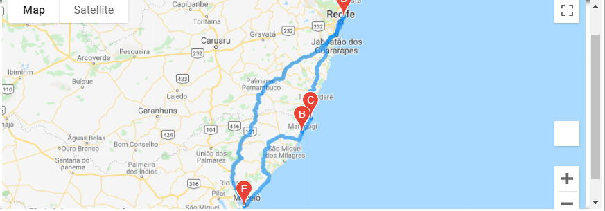

# World_Weather_Analysis
Analyze World Weather Data using Python

## Overview of Project
**Task:** Collect and analyze weather data across cities worldwide.

**Purpose:** PlanMyTrip will use the data to recommend ideal hotels based on clients' weather preferences.

**Method:** Create a Pandas DataFrame with 500 or more of the world's unique cities and their weather data in real time. This process will entail collecting, analyzing, and visualizing the data.**

**The Analysis should include the following information:** 

1. Retrieve Weather Data
2. Create a Customer Travel Destinations Map
3. Create a Travel Itinerary Map

## Resources
- Data Source: [WeatherPy_Database.csv](Weather_Database/WeatherPy_Database.csv); [WeatherPy_vacation.csv](Vacation_Search/WeatherPy_vacation.csv)
- Source Code: 
    [Weather_Database](Weather_Database/Weather_Database.ipynb); 
    [Vacation_Search](Vacation_Search/Vacation_Search.ipynb);
    [Vacation_Itinerary](Vacation_Itinerary/Vacation_Itinerary.ipynb)
- Software: Python 3.7.9 64-bit (conda); jupyter-notebook : 6.1.4
- APIs: openWeatherWeather API (https://openweathermap.org/api); Google Maps APIs

## Results
- **The following has been created (Weather_Database folder):**

   - Generate a set of 2,000 random latitudes and longitudes
   - Retrieve the nearest city
   - Perform an API call with the OpenWeatherMap
   - Retrieve the current weather data including weather description for each city
   - Create a new DataFrame containing the updated weather data and print to a csv file
   
   [WeatherPy_Database.csv](Weather_Database/WeatherPy_Database.csv)

- **The following has been created (Vacation_Search folder):**
    - Use input statements to retrieve customer weather preferences
    - Use those preferences to identify potential travel destinations and nearby hotels 
    - Show those destinations on a marker layer map with pop-up markers

    

- **The following has been created (Vacation_Itinerary folder):**
    - Use the Google Directions API to create a travel itinerary that shows the route between four cities     chosen from the customer’s possible travel destinations
    - Create a marker layer map with a pop-up marker for each city on the itinerary

    

    
    
    

